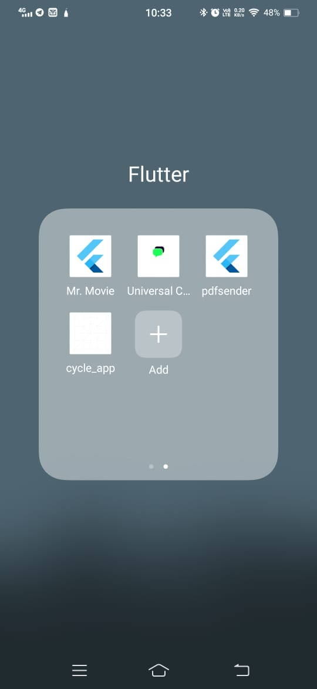

# Flutter Messanging Application
<!-- Name of the application will change soon -->
name: Flutter Chat 

## Description
This is a simple chat application built using flutter and firebase. This application is still under development.
I already made an first working model of this application.

### Images of the application



**Note:** This is not the final version of the application. I will update the images and video soon.

### Firebase Features 
This feature i wanted to used in this application.
<!-- Lol i wanted to use all the firebase feature in this application which comes in free tier -->
- [x] Google Sign In
- [x] Firebase Authentication
- [x] Firebase Cloud Firestore
- [x] Firebase Storage
- [x] Firebase Cloud Messaging
- [ ] Firebase Analytics
- [ ] Firebase Crashlytics
- [ ] Firebase Performance Monitoring
- [ ] Firebase Test Lab
- [ ] Firebase App Distribution
- [ ] Firebase In-App Messaging


## Getting Started

### Prerequisites
- [Flutter](https://flutter.dev/docs/get-started/install)
- [Visual Studio Code](https://code.visualstudio.com/)
- [Android Studio](https://developer.android.com/studio)
<!-- lol i don't have macos  -->
<!-- I will add by me a coffee part -->
- [Xcode](https://developer.apple.com/xcode/) (MacOS only)
- [Firebase](https://firebase.google.com/)

- [Git](https://git-scm.com/downloads)


### Dependencies
  cupertino_icons
  cloud_firestore
  firebase_auth
  firebase_core
  firebase_messaging
  firebase_storage
  <!-- TODO: Not completed the set-up part ok -->
  flutter_notification_channel 

  image_picker
  flutter_lints


### Installing 
1. Clone the repository
```bash
git clone https://github.com/DeepeshKalura/flutter_messanging_app
cd flutter_messanging_app
```
2. Install the dependencies
```bash
flutter pub get
```
<!-- Need to config myself one time -->
3. Confire the firebase project
```bash
firebase-cli login
firebase init
```
4. Run the application
```bash
flutter run
```

### Play with the widgets
1. Appbar
2. Bottom Navigation Bar
3. AnimatedPositioned
4. 


## Added New Dependencies
1. connectivity_plus